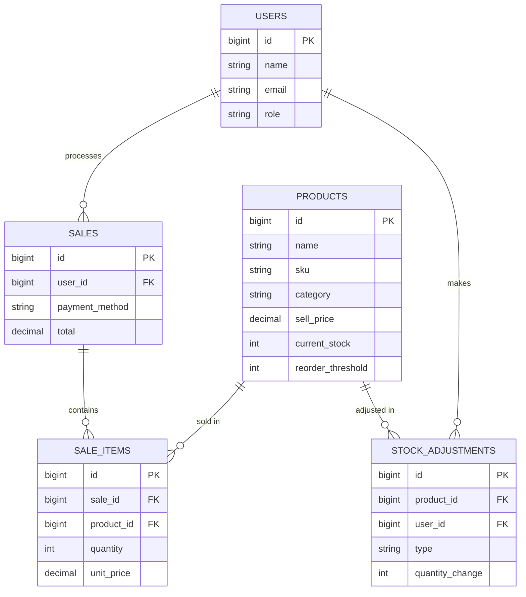

# ERD — CWG Retail Suite
Agreed by: Kanx + [Partner], [date]
Status: LIVING DOCUMENT — same rule as the API contract. Update here before changing the database.

---

## Entities & Fields

### users
| Field                   | Type                     | Notes                                           |
| ----------------------- | ------------------------ | ----------------------------------------------- |
| id                      | bigint, PK               |                                                 |
| name                    | string                   |                                                 |
| email                   | string, unique           |                                                 |
| password                | string (hashed)          | never returned in any API response              |
| role                    | enum: `owner`, `cashier` | drives frontend nav + backend permission checks |
| created_at / updated_at | timestamp                |                                                 |

### products
| Field                   | Type             | Notes                                                                                                                          |
| ----------------------- | ---------------- | ------------------------------------------------------------------------------------------------------------------------------ |
| id                      | bigint, PK       |                                                                                                                                |
| name                    | string           |                                                                                                                                |
| sku                     | string, unique   | barcode/product code                                                                                                           |
| category                | string           | e.g. drinks, groceries, household                                                                                              |
| cost_price              | decimal          | what the shop paid — used for profit reporting, not shown to cashiers                                                          |
| sell_price              | decimal (₦)      | what the customer pays                                                                                                         |
| current_stock           | integer          | source of truth for stock level                                                                                                |
| reorder_threshold       | integer          | **rule: fixed number set once per product by the Owner when the product is created/edited** — not dynamic, not auto-calculated |
| image_path              | string, nullable |                                                                                                                                |
| created_at / updated_at | timestamp        |                                                                                                                                |

### sales
| Field          | Type                             | Notes                                                                     |
| -------------- | -------------------------------- | ------------------------------------------------------------------------- |
| id             | bigint, PK                       |                                                                           |
| user_id        | bigint, FK → users.id            | the cashier who processed the sale                                        |
| payment_method | enum: `cash`, `card`, `transfer` |                                                                           |
| subtotal       | decimal                          | sum of line totals before any adjustment                                  |
| total          | decimal                          | final amount charged (equal to subtotal unless discounts are added later) |
| created_at     | timestamp                        | acts as the sale's date/time                                              |

### sale_items
| Field      | Type                     | Notes                                                                                                          |
| ---------- | ------------------------ | -------------------------------------------------------------------------------------------------------------- |
| id         | bigint, PK               |                                                                                                                |
| sale_id    | bigint, FK → sales.id    |                                                                                                                |
| product_id | bigint, FK → products.id |                                                                                                                |
| quantity   | integer                  | units sold in this line                                                                                        |
| unit_price | decimal                  | price *at time of sale* (copied from product.sell_price — protects historical accuracy if prices change later) |
| line_total | decimal                  | quantity × unit_price                                                                                          |

### stock_adjustments
| Field           | Type                                    | Notes                                                                 |
| --------------- | --------------------------------------- | --------------------------------------------------------------------- |
| id              | bigint, PK                              |                                                                       |
| product_id      | bigint, FK → products.id                |                                                                       |
| user_id         | bigint, FK → users.id                   | staff member who made the adjustment                                  |
| type            | enum: `restock`, `correction`, `damage` |                                                                       |
| quantity_change | integer                                 | positive for restock, negative for damage/loss, either for correction |
| reason          | string, nullable                        | free-text note                                                        |
| created_at      | timestamp                               |                                                                       |

---

## Relationships

**In plain words:**
- One **user** (cashier or owner) can process many **sales**.
- One **sale** contains many **sale_items** — one row per product sold in that transaction.
- One **product** can appear in many **sale_items** across many different sales.
- One **product** can have many **stock_adjustments** over time (restocks, corrections, damage).
- One **user** can make many **stock_adjustments**.

---

## Key business rule (from P1: "define the reorder-threshold rule")
`reorder_threshold` is a **fixed integer, set once per product by the Owner** (at creation, editable later) — it is not calculated dynamically from sales velocity or any other data. A product's `stock_status` (in_stock / low_stock / out_of_stock) is derived by the backend by comparing `current_stock` to this stored threshold, at the moment of any read (never stored as its own column, to avoid it going stale).

## How stock actually changes (ties ERD to the stock-deduction logic)
- A **sale** does NOT directly store stock changes — instead, creating a sale triggers the backend's stock-deduction service, which decrements `products.current_stock` by each line item's quantity, inside one DB transaction with row locking, so concurrent sales can't push stock negative.
- A **stock_adjustment** (restock/correction/damage) directly increments or decrements `products.current_stock` by `quantity_change`, also inside a transaction, and leaves a permanent audit row of who did it and why.

---

## Worked Example (sample data — useful as seed data for testing)

**Scenario:** Chidi (cashier) makes two sales during his morning shift; Coca-Cola stock drops below its reorder threshold; Amaka (owner) restocks it that afternoon.

**users**
| id  | name      | email               | role    |
| --- | --------- | ------------------- | ------- |
| 1   | Amaka Obi | owner@cwgretail.com | owner   |
| 2   | Chidi Eze | chidi@cwgretail.com | cashier |

**products** (starting stock)
| id  | name            | sku   | category  | sell_price | current_stock | reorder_threshold |
| --- | --------------- | ----- | --------- | ---------- | ------------- | ----------------- |
| 1   | Coca-Cola 50cl  | CC-50 | drinks    | 500        | 12            | 10                |
| 2   | Indomie Noodles | IN-70 | groceries | 350        | 30            | 15                |

**9:15am — Sale #1: 1 Coke + 2 Indomie**

sales
| id  | user_id | payment_method | subtotal | total | created_at |
| --- | ------- | -------------- | -------- | ----- | ---------- |
| 1   | 2       | cash           | 1200     | 1200  | 09:15am    |

sale_items
| id  | sale_id | product_id | quantity | unit_price | line_total |
| --- | ------- | ---------- | -------- | ---------- | ---------- |
| 1   | 1       | 1          | 1        | 500        | 500        |
| 2   | 1       | 2          | 2        | 350        | 700        |

→ products.current_stock after: Coca-Cola = 11, Indomie = 28

**11:40am — Sale #2: 2 more Cokes**

sales
| id  | user_id | payment_method | subtotal | total | created_at |
| --- | ------- | -------------- | -------- | ----- | ---------- |
| 2   | 2       | transfer       | 1000     | 1000  | 11:40am    |

sale_items
| id  | sale_id | product_id | quantity | unit_price | line_total |
| --- | ------- | ---------- | -------- | ---------- | ---------- |
| 3   | 2       | 1          | 2        | 500        | 1000       |

→ products.current_stock after: Coca-Cola = **9** → now below reorder_threshold (10) → `stock_status` flips to `low_stock`

**3:00pm — Amaka restocks Coca-Cola by 24 units**

stock_adjustments
| id  | product_id | user_id | type    | quantity_change | reason                       | created_at |
| --- | ---------- | ------- | ------- | --------------- | ---------------------------- | ---------- |
| 1   | 1          | 1       | restock | +24             | Weekly restock from supplier | 03:00pm    |

→ products.current_stock after: Coca-Cola = 33 (9 + 24) → `stock_status` back to `in_stock`

**Takeaways this example demonstrates:**
- One sale can span multiple `sale_items` rows (one per distinct product in the cart).
- `current_stock` is the single number both sales and adjustments modify — through two separate, explicit code paths, never edited directly.
- `stock_adjustments` is a permanent audit log — every stock change outside a sale is traceable to who did it, when, and why.
- `stock_status` is never stored — it's calculated live from `current_stock` vs `reorder_threshold` on every read.
